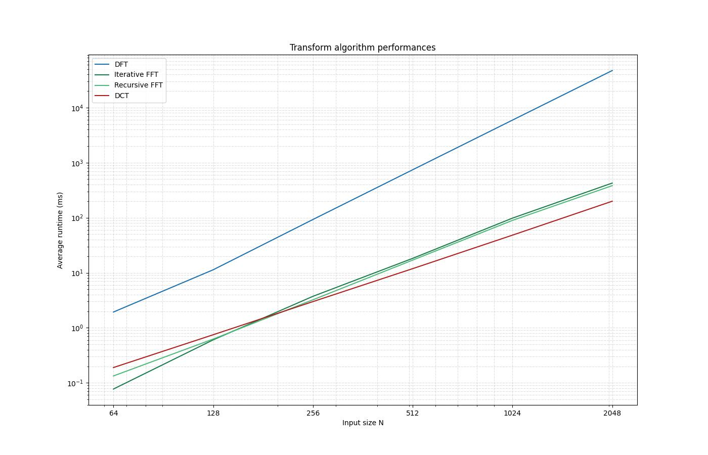
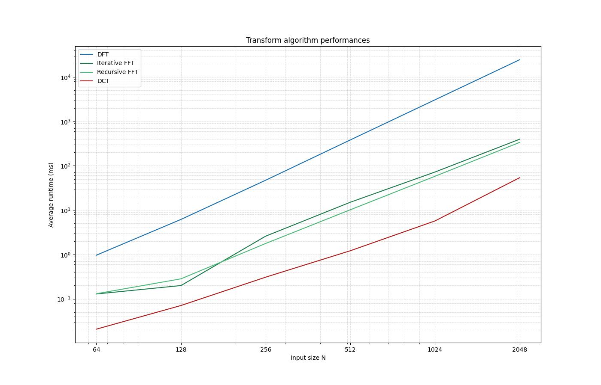
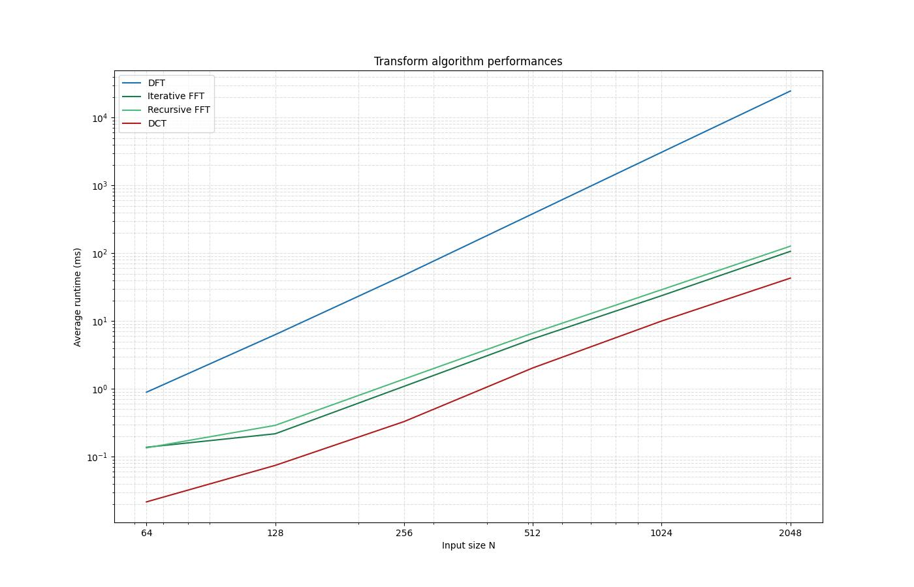
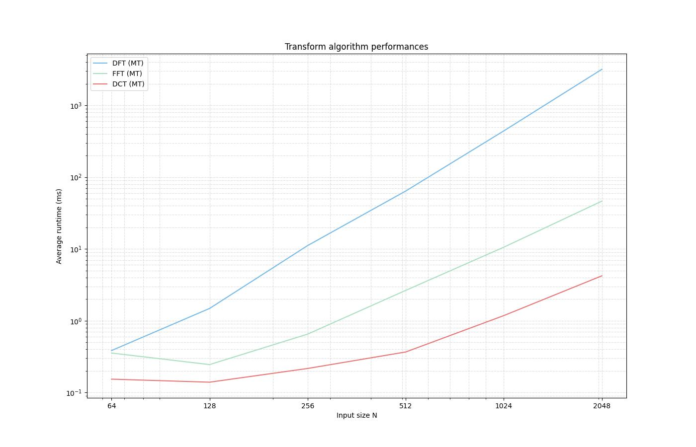
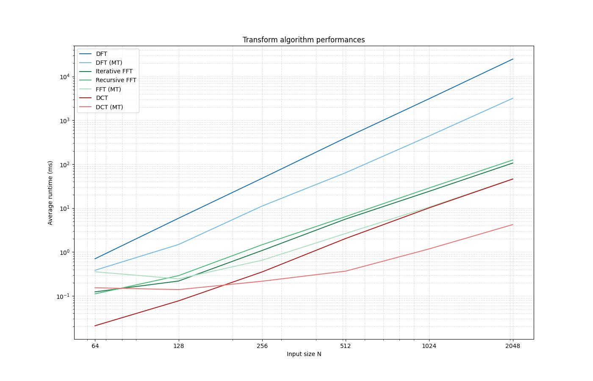

# 2d-transform-bench

Benchmarking suite for 2D image transforms implemented in C++. Compares the performance of three frequency-domain transforms — DFT, FFT, and DCT — applied to N×N grayscale images across a range of input sizes (64–2048).

## Algorithms

### DFT — Discrete Fourier Transform
- Naïve O(N²) 1D transform applied separately to each row then each column, giving **O(N⁴)** total complexity for a 2D image
- Complex-valued (`std::complex<float>`), works on arbitrary dimensions
- Provided as a correctness baseline; impractically slow at large sizes

### FFT — Fast Fourier Transform
- Radix-2 Cooley-Tukey algorithm, **O(N² log N)** total for 2D
- Both iterative (bottom-up, with twiddle-factor caching) and recursive variants
- Requires power-of-2 dimensions; input is zero-padded automatically
- Complex-valued (`std::complex<float>`)

### DCT — Discrete Cosine Transform
- Real-valued JPEG-style **8×8 block** decomposition with a precomputed cosine lookup table
- Standard JPEG luminance quantization table, scaled by a quality parameter
- Input padded to the nearest multiple of 8

All three algorithms have multi-threaded variants that distribute work across `std::jthread` workers. DFT and FFT split row/column passes evenly across threads; DCT assigns independent 8×8 blocks to threads, one chunk per hardware thread.

## Build & Usage

```sh
make all          # builds main, benchmark, and equality_test
```

**Image transform tool:**
```sh
./main [-t] --dft|--fft|--dct <input.png> <output.png> [quality]
# -t       : enable multi-threaded execution (default: single-threaded)
# quality  : 0.0–1.0, fraction of coefficients to retain (default 0.5)
```

**Benchmark harness:**
```sh
./benchmark       # writes timing CSV to stdout
```

The benchmark uses adaptive run counts (more iterations for small N, fewer for large N) and reports the average runtime in milliseconds per transform.

## Benchmarking Journey

### Iteration 1 — Double precision, strided column passes

The initial implementation used `double` precision arithmetic. Column passes were performed using strided memory access directly on the row-major flattened buffer — every N-th element — rather than operating on contiguous data.



| N    | DFT (ms)  | FFT Iter (ms) | FFT Recur (ms) | DCT (ms) |
|------|-----------|---------------|----------------|----------|
| 64   | 1.93      | 0.077         | 0.134          | 0.190    |
| 256  | 92.8      | 3.73          | 3.23           | 2.99     |
| 1024 | 5,927     | 98.3          | 89.4           | 48.2     |
| 2048 | 47,136    | 425.9         | 382.2          | 199.3    |

The O(N⁴) scaling of DFT is already dramatic at N=2048 (~47 seconds). FFT is ~110× faster. DCT, despite operating on real data in 8×8 blocks, trails iterative FFT by about 2×.

---

### Iteration 2 — Float precision, strided column passes

Switched the internal data type from `double` to `float`, keeping the same strided column-access strategy.



| N    | DFT (ms)  | FFT Iter (ms) | FFT Recur (ms) | DCT (ms) |
|------|-----------|---------------|----------------|----------|
| 64   | 0.961     | 0.128         | 0.130          | 0.021    |
| 256  | 47.2      | 2.58          | 1.77           | 0.308    |
| 1024 | 3,068     | 72.3          | 57.9           | 5.71     |
| 2048 | 24,612    | 396.6         | 336.5          | 53.9     |

The float switch roughly halved DFT and FFT runtimes. DCT improved by ~4× (from 199 ms to 54 ms at N=2048).

**Why it helps:** A 256-bit AVX2 register fits 4 `double` values but 8 `float` values, so the compiler can vectorize twice as many arithmetic operations per instruction. Halving the element size also halves memory bandwidth consumption and doubles effective cache capacity, which matters especially for DCT's sequential 8×8 block reads. DFT and FFT see a more modest ~2× gain because their complex arithmetic mixes multiplies and adds in patterns that are harder for the auto-vectorizer to fully exploit.

---

### Iteration 3 — Transposed column passes

Instead of accessing columns via strides, the flattened image matrix is transposed in-place before the column pass so that what were columns are now laid out contiguously in memory. The matrix is transposed back afterwards.



| N    | DFT (ms)  | FFT Iter (ms) | FFT Recur (ms) | DCT (ms) |
|------|-----------|---------------|----------------|----------|
| 64   | 0.891     | 0.137         | 0.135          | 0.022    |
| 256  | 47.4      | 1.09          | 1.39           | 0.329    |
| 1024 | 3,083     | 23.7          | 29.0           | 9.999    |
| 2048 | 24,688    | 106.7         | 127.1          | 42.9     |

The improvement is striking for FFT: iterative FFT at N=2048 drops from 397 ms to 107 ms (~3.7× faster). DFT is unchanged.

**Why it helps:** The strided column pass jumps N elements between successive accesses. At N=2048 with `float` that is an 8 KB stride, far exceeding a typical 64-byte cache line; every access is a cache miss. Transposing first turns those column reads into a sequential scan, saturating prefetch hardware and eliminating the misses. DFT sees no benefit because its O(N⁴) runtime is dominated by arithmetic (N² multiply-adds per output element), not by memory latency — the ratio of compute to data movement is too high for cache behaviour to be the bottleneck.

---

### Iteration 4 — Multi-threaded passes

DFT and FFT parallelize by distributing rows/columns evenly across `std::jthread` workers. DCT was refactored to assign individual **8×8 blocks** to threads rather than row/column chunks, so each thread operates on a fully independent block with no shared state.



| N    | DFT (MT, ms) | FFT (MT, ms) | DCT (MT, ms) |
|------|--------------|--------------|--------------|
| 64   | 0.384        | 0.355        | 0.153        |
| 256  | 11.1         | 0.651        | 0.216        |
| 1024 | 441.1        | 10.57        | 1.18         |
| 2048 | 3,180.5      | 46.4         | 4.22         |

At N=2048, threading delivers roughly **2.3× speedup for FFT** (107 ms → 46 ms) and an **~11× speedup for DCT** (46 ms → 4.2 ms) relative to the transposed single-threaded baseline. DFT benefits most proportionally (~8×, from 24,688 ms to 3,181 ms).

**Why the speedups differ:** DFT's O(N⁴) workload grows so quickly that at N=2048 each thread has seconds of arithmetic to process independently, giving near-linear scaling. FFT's twiddle-factor cache uses a mutex that serialises first-access initialisation per transform size, introducing a small bottleneck that caps parallel efficiency. DCT's block-level threading gives the largest relative gain: each 8×8 block is entirely self-contained (no row/column synchronisation needed, no shared cache), so work fans out across all cores with minimal contention. The number of blocks scales as (N/8)², so at N=2048 there are 65,536 independent work units — far more than the thread count — keeping all cores busy throughout. At small N (64–128), thread launch and join overhead exceeds the work per thread, so all algorithms are slower with threading than without.

---

### Iteration 5 — Comprehensive comparison

The final dataset captures all variants — single-threaded and multi-threaded — together for direct comparison.



| N    | DFT (ms) | DFT MT (ms) | FFT Iter (ms) | FFT Recur (ms) | FFT MT (ms) | DCT (ms) | DCT MT (ms) |
|------|----------|-------------|---------------|----------------|-------------|----------|-------------|
| 64   | 0.701    | 0.384       | 0.124         | 0.111          | 0.355       | 0.021    | 0.153       |
| 128  | 5.89     | 1.48        | 0.218         | 0.289          | 0.245       | 0.077    | 0.139       |
| 256  | 47.8     | 11.1        | 1.08          | 1.47           | 0.651       | 0.352    | 0.216       |
| 512  | 399.6    | 64.1        | 5.64          | 6.43           | 2.65        | 2.03     | 0.367       |
| 1024 | 3,110    | 441.1       | 24.2          | 28.8           | 10.6        | 10.2     | 1.18        |
| 2048 | 24,868   | 3,181       | 106.5         | 124.7          | 46.4        | 46.0     | 4.22        |

At N=2048, multi-threaded DCT (4.2 ms) is now **~11× faster than its single-threaded counterpart** and more than **10× faster than multi-threaded FFT** (46.4 ms), a result of switching to per-block threading. End-to-end, multi-threaded DCT at N=2048 is **~5,900× faster than single-threaded DFT** at the same size.

---

## Key Takeaways

| Optimization | Primary Beneficiary | Speedup at N=2048 |
|---|---|---|
| `double` → `float` | DCT, FFT, DFT | DCT ~4×, FFT ~1.9×, DFT ~1.9× |
| Strided → transposed column access | FFT | ~3.7× |
| Row/col threading → per-block threading (DCT) | DCT | ~11× |
| Row/col threading (DFT, FFT) | DFT, FFT | DFT ~8×, FFT ~2.3× |
| **Overall: MT DCT vs. single-threaded DFT** | — | **~5,900×** |

- **DFT is ~230–500× slower than FFT** at N=2048 due to its O(N⁴) vs O(N² log N) scaling.
- **Cache locality matters more than arithmetic** for FFT: the transposition optimization outperformed the float conversion.
- **DCT's 8×8 block structure is a threading superpower**: blocks are fully independent, producing (N/8)² work units that saturate all cores with zero contention — yielding ~11× speedup vs ~2.3× for FFT.
- **Threading pays off at large N** but introduces overhead that hurts small inputs (N ≤ 128).
