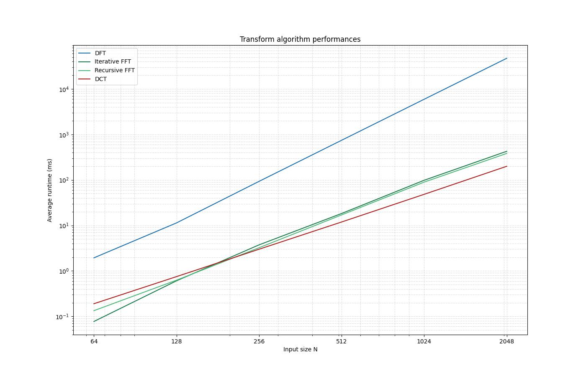
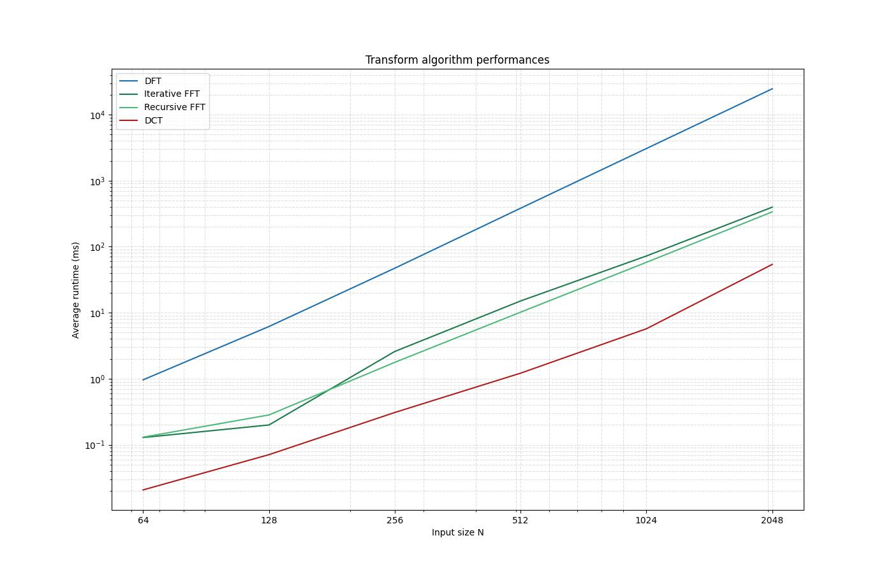
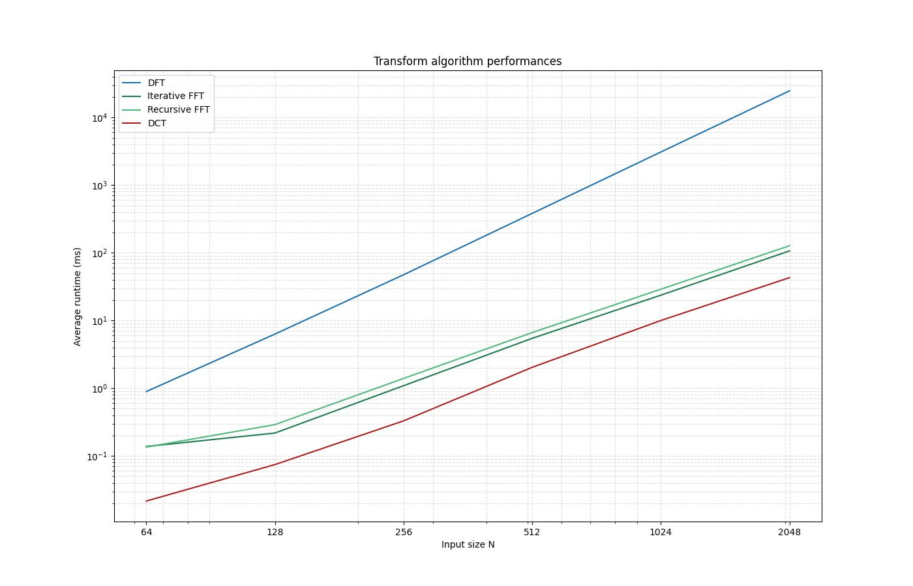
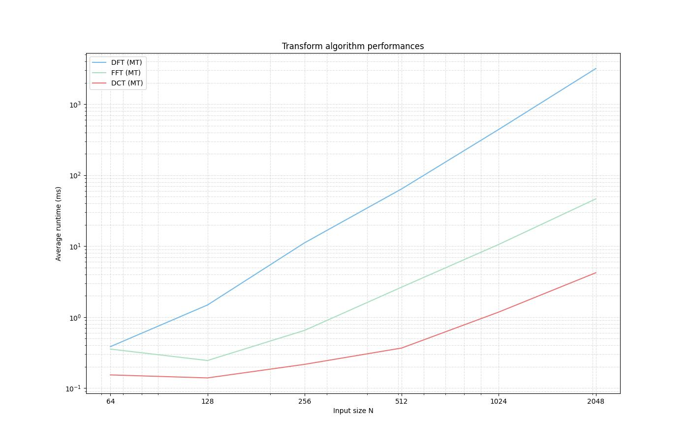
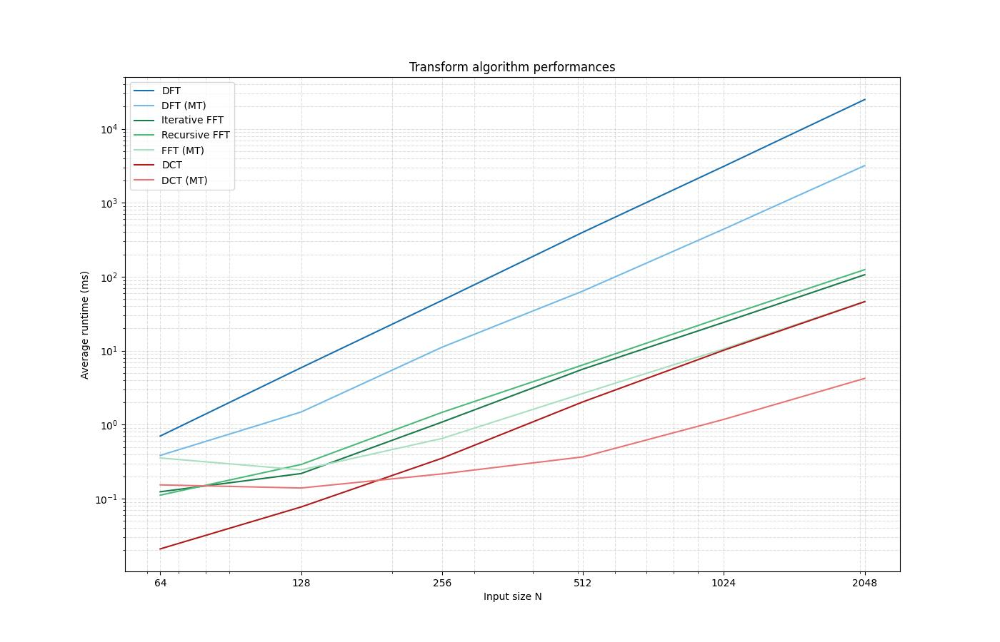

# 2d-transform-bench

Benchmarking suite for 2D image transforms in C++. Compares DFT, FFT, and DCT applied to N×N grayscale images across input sizes 64–2048.

## Algorithms

### DFT — Discrete Fourier Transform
- Naïve O(N²) 1D transform applied row-then-column, giving **O(N⁴)** total complexity
- Complex-valued (`std::complex<float>`), works on arbitrary dimensions
- Correctness baseline; impractically slow at large sizes

### FFT — Fast Fourier Transform
- Radix-2 Cooley-Tukey, **O(N² log N)** total for 2D
- Iterative (bottom-up, with twiddle-factor caching) and recursive variants
- Requires power-of-2 dimensions; input is zero-padded automatically
- Complex-valued (`std::complex<float>`)

### DCT — Discrete Cosine Transform
- Real-valued JPEG-style **8×8 block** decomposition with a precomputed cosine lookup table
- Standard JPEG luminance quantization table, scaled by a quality parameter
- Input padded to the nearest multiple of 8

All three algorithms have multi-threaded variants using `std::jthread`. DFT and FFT split row/column passes across threads; DCT assigns independent 8×8 blocks to threads.

## Build & Usage

```sh
make all          # builds main, benchmark, and equality_test
```

**Image transform tool:**
```sh
./main [-t] --dft|--fft|--dct <input.png> <output.png> [quality]
# -t       : enable multi-threaded execution (default: single-threaded)
# quality  : 0.0–1.0, fraction of coefficients to retain (default 0.5)
```

**Benchmark harness:**
```sh
./benchmark       # writes timing CSV to stdout
```

The benchmark uses adaptive run counts and reports average runtime in milliseconds per transform.

## Benchmarking Journey

### Iteration 1 — Double precision, strided column passes

Initial implementation used `double` precision with strided memory access for column passes (jumping every N-th element in the row-major buffer).



| N    | DFT (ms)  | FFT Iter (ms) | FFT Recur (ms) | DCT (ms) |
|------|-----------|---------------|----------------|----------|
| 64   | 1.93      | 0.077         | 0.134          | 0.190    |
| 256  | 92.8      | 3.73          | 3.23           | 2.99     |
| 1024 | 5,927     | 98.3          | 89.4           | 48.2     |
| 2048 | 47,136    | 425.9         | 382.2          | 199.3    |

DFT's O(N⁴) scaling is already dramatic at N=2048 (~47 s). FFT is ~110× faster.

---

### Iteration 2 — Float precision, strided column passes

Switched from `double` to `float`, keeping the same strided column-access strategy.



| N    | DFT (ms)  | FFT Iter (ms) | FFT Recur (ms) | DCT (ms) |
|------|-----------|---------------|----------------|----------|
| 64   | 0.961     | 0.128         | 0.130          | 0.021    |
| 256  | 47.2      | 2.58          | 1.77           | 0.308    |
| 1024 | 3,068     | 72.3          | 57.9           | 5.71     |
| 2048 | 24,612    | 396.6         | 336.5          | 53.9     |

Halved runtimes for DFT and FFT; DCT improved ~4× (199 ms → 54 ms at N=2048). A 256-bit AVX2 register fits 8 `float` values vs. 4 `double`, doubling SIMD throughput and halving memory bandwidth.

---

### Iteration 3 — Transposed column passes

Before each column pass, the matrix is transposed in-place so columns are laid out contiguously in memory. Transposed back afterwards.



| N    | DFT (ms)  | FFT Iter (ms) | FFT Recur (ms) | DCT (ms) |
|------|-----------|---------------|----------------|----------|
| 64   | 0.891     | 0.137         | 0.135          | 0.022    |
| 256  | 47.4      | 1.09          | 1.39           | 0.329    |
| 1024 | 3,083     | 23.7          | 29.0           | 9.999    |
| 2048 | 24,688    | 106.7         | 127.1          | 42.9     |

Iterative FFT at N=2048 drops from 397 ms to 107 ms (~3.7×). The strided column pass caused a cache miss on every access (8 KB stride at N=2048); contiguous access after transposition eliminates them. DFT is unchanged — its O(N⁴) workload is compute-bound, not memory-bound.

---

### Iteration 4 — Multi-threaded passes

DFT and FFT distribute row/column work across `std::jthread` workers. DCT was refactored to assign individual **8×8 blocks** to threads, so each thread operates on a fully independent block.



| N    | DFT (MT, ms) | FFT (MT, ms) | DCT (MT, ms) |
|------|--------------|--------------|--------------|
| 64   | 0.384        | 0.355        | 0.153        |
| 256  | 11.1         | 0.651        | 0.216        |
| 1024 | 441.1        | 10.57        | 1.18         |
| 2048 | 3,180.5      | 46.4         | 4.22         |

At N=2048: ~**8× for DFT**, ~**2.3× for FFT**, ~**11× for DCT**. DFT scales nearly linearly because each thread processes seconds of independent arithmetic. DCT's per-block threading generates (N/8)² = 65,536 independent work units at N=2048, saturating all cores with zero contention. FFT's twiddle-factor cache uses a mutex that slightly caps parallel efficiency. Threading hurts at small N (≤128) where launch overhead exceeds the work per thread.

---

### Iteration 5 — Comprehensive comparison

All variants — single-threaded and multi-threaded — together for direct comparison.



| N    | DFT (ms) | DFT MT (ms) | FFT Iter (ms) | FFT Recur (ms) | FFT MT (ms) | DCT (ms) | DCT MT (ms) |
|------|----------|-------------|---------------|----------------|-------------|----------|-------------|
| 64   | 0.701    | 0.384       | 0.124         | 0.111          | 0.355       | 0.021    | 0.153       |
| 128  | 5.89     | 1.48        | 0.218         | 0.289          | 0.245       | 0.077    | 0.139       |
| 256  | 47.8     | 11.1        | 1.08          | 1.47           | 0.651       | 0.352    | 0.216       |
| 512  | 399.6    | 64.1        | 5.64          | 6.43           | 2.65        | 2.03     | 0.367       |
| 1024 | 3,110    | 441.1       | 24.2          | 28.8           | 10.6        | 10.2     | 1.18        |
| 2048 | 24,868   | 3,181       | 106.5         | 124.7          | 46.4        | 46.0     | 4.22        |

At N=2048, multi-threaded DCT (4.2 ms) is **~11× faster than single-threaded DCT** and **~11× faster than multi-threaded FFT** (46.4 ms). End-to-end, MT DCT is **~5,900× faster than single-threaded DFT**.

---

## Key Takeaways

| Optimization | Primary Beneficiary | Speedup at N=2048 |
|---|---|---|
| `double` → `float` | DCT, FFT, DFT | DCT ~4×, FFT ~1.9×, DFT ~1.9× |
| Strided → transposed column access | FFT | ~3.7× |
| Row/col threading → per-block threading (DCT) | DCT | ~11× |
| Row/col threading (DFT, FFT) | DFT, FFT | DFT ~8×, FFT ~2.3× |
| **Overall: MT DCT vs. single-threaded DFT** | — | **~5,900×** |

- **DFT is ~230–500× slower than FFT** at N=2048 due to O(N⁴) vs O(N² log N) scaling.
- **Cache locality matters more than arithmetic** for FFT: the transposition optimization outperformed the float conversion.
- **DCT's 8×8 block structure is a threading superpower**: blocks are fully independent, saturating all cores with zero contention.
- **Threading pays off at large N** but introduces overhead that hurts small inputs (N ≤ 128).

## AI Disclosure

This project was developed with limited but intentional use of AI assistance. Claude (Anthropic) was used for:

- **Writing this README** — structure, prose, and analysis
- **Adding explanatory comments** throughout the codebase
- **Handling git commits** — writing commit messages and staging changes
- **Code review** — reviewing implementations for correctness and style

All implementation code was written entirely by me. No line of production code was generated or modified by AI.
